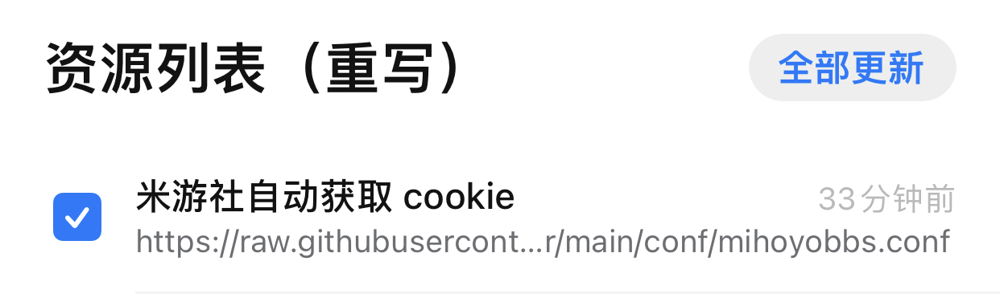
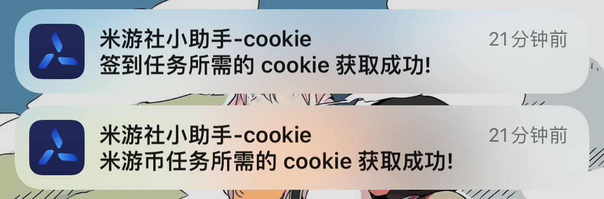

# 米游社小助手

 [](https://github.com/kayanouriko/quantumultx-genshin-autosign-helper/releases)

一个 quantumultx 脚本, 主要用于米游社米游币任务和游戏签到的自动运行.

## 前言

该脚本只适配了国服账号.

使用该项目之前, 你需要提前了解如何使用 quantumultx 拉取远程仓库和执行脚本.

虽然是参照 quantumultx 编写, 但是使用的模块封装应该也适配 shadowrocket, loon, surge, stash. 

别家应用的用户可以自行测试一下, 行就行, 不行也别找我了Orz

## 更新日志
* v2.1.0
    1. 适配 崩坏3rd 签到新接口. [@接口改版抓包讨论](https://github.com/Womsxd/AutoMihoyoBBS/issues/151)
* v2.0.3
    1. 修复分享任务代码造成的米游币任务完成提示文本错误
* v2.0.2
    1. 修复分享任务成功判断问题
* v2.0.1
    1. 缩短米游币任务报告文本
    2. 修复分享任务报告文本无法显示的问题
* v2.0.0
    1. 支持米游币任务和崩坏3rd签到
    2. 自动获取 cookie
    3. 可自定义任务执行配置
* v1.1.1
    1. 优化代码逻辑
* v1.1.0 
    1. 新增签到奖励信息
    2. 优化代码逻辑
* v1.0.0 
    1. 初版

## 如何使用(2.x)

v2.0.0开始, 在 quantumultx 中全面转为远程更新和执行, 配置一次, 自动更新, 永久运行.  

目前 qx 并不会自动升级远程配置的脚本, 当你发现脚本功能不可用时, 可先看该项目是否已经更新修复了, 再尝试在 qx 内更新脚本以获取最新的修复.

### 引入资源

1. 获取重写配置文件

|      |
| :-----------------------------: |
| 打开设置-重写-引用<br>rewrite-1 |

|      |
| :-----------------------------: |
| 点击右上角添加连接<br>rewrite-2 |

|                                    |
| :-----------------------------------------------------------: |
| 写入远程重写配置文件连接和标签名, 点击右上角保存<br>rewrite-3 |

```
// 资源路径连接
https://raw.githubusercontent.com/kayanouriko/quantumultx-mihoyobbs-auto-helper/main/conf/mihoyobbs.conf
```

2. 获取任务脚本仓库和脚本

|          |
| :------------------------------: |
| 打开应用底部最右侧图标<br>task-1 |

|  |
| :----------------------: |
|  点击红框图标<br>task-2  |

|                |
| :------------------------------------: |
| 点击右上角加号, 输入仓库地址<br>task-3 |

```
// 仓库地址连接
https://raw.githubusercontent.com/kayanouriko/quantumultx-mihoyobbs-auto-helper/main/gallery/gallery.json
```

|                  |
| :--------------------------------------: |
| 点击米游社小助手任务添加到本地<br>task-4 |

|                |
| :------------------------------------: |
| 请求列表如图所示即为添加成功<br>task-5 |

### 获取 cookie

|            |
| :-----------------------------------: |
| 保证重写列表的为打开状态<br>rewrite-5 |

打开米游社 app, 此时会弹出第一条获取成功的通知, 再随便打开一个游戏的签到页面, 会收到第二条获取成功的通知. 如下所示

|              |
| :-------------------------------------: |
| 获取 cookie 成功的两条通知<br>rewrite-4 |

关闭重写列表, 以后 cookie 失效了再重新打开重复以上步骤重新获取 cookie 即可.

|  |
| :-------------------------: |
|  取消打勾操作<br>rewrite-2  |

### 至此, 脚本可以运行了.

### 进阶用法(自定义配置)

|  参数名  |            说明            |                                                              值                                                               |
| :------: | :------------------------: | :---------------------------------------------------------------------------------------------------------------------------: |
|  tasks   |     需要自动执行的任务     |                1. 米游币任务 2. 原神签到 3. 崩坏 3rd 签到. <br>默认为 1,2,3 执行米游币, 原神, 崩坏3rd 3个任务                 |
| scetions | 需要执行米游币任务的讨论区 | 1. 崩坏3, 26. 原神 30. 崩坏学园2 37. 未定事件簿 34. 大别野 52. 崩坏：星穹铁道 <br>默认为 34, 即在大别野帖子列表执行米游币任务 |
| actions  |    需要执行的米游币任务    |          58. 讨论区签到 59. 浏览 3 个帖子 60. 完成 5 次点赞 61. 分享帖子 <br>默认为 58,59,60,61 执行米游社的全部任务          |

#### 自定义配置使用方法

|            |
| :-----------------------------------: |
| 保证重写列表的为打开状态<br>rewrite-5 |

打开 safari 浏览器, 访问 `https://example.com/?参数名=值` 即可, 弹出设置成功的通知即为成功.

* 注1: 这里的 `https://example.com/?` 是固定的, 必须是这个网址才能设置成功.

* 注2: 关于链接 GET 请求传参的相关知识请参考: [Query String](https://en.wikipedia.org/wiki/Query_string)

例如: `https://example.com/?tasks=1,2&actions=58,59` 表示脚本执行 米游币任务 原神签到任务, 并且米游币任务中执行讨论区签到, 浏览 3 个帖子两个任务.

关闭重写列表, 以后想要重新自定义配置项重复上述步骤即可.

|  |
| :-------------------------: |
|  取消打勾操作<br>rewrite-2  |

## 如何使用(1.x)

1. 获取 cookie (感谢: [@Finger36](https://github.com/Finger36/genshin-helper))
    1. 打开你的浏览器,进入**无痕/隐身模式**
    2. 由于米哈游修改了 bbs 可以获取的 cookie，导致一次获取的 cookie 缺失，所以需要增加步骤
    3. 打开 http://bbs.mihoyo.com/ys 并进行登入操作
    4. 在上一步登入完成后新建标签页，打开 http://user.mihoyo.com 并进行登入操作
    5. 按下键盘上的 F12 或右键检查,打开开发者工具,点击 Console
    6. 复制以下代码并回车
    ```javascript
    var cookie = document.cookie
    var ask = confirm('Cookie:' + cookie + '\n\nDo you want to copy the cookie to the clipboard?')
    if (ask == true) {
      copy(cookie)
      msg = cookie
    } else {
      msg = 'Cancel'
    }
    ```
    7. 此时`Cookie`已经复制到你的粘贴板上了

2. 下载 js 文件: [releases](https://github.com/kayanouriko/quantumultx-genshin-autosign-helper/releases)
3. 打开 js 文件, 在 `$.cookie = ''` 引号内填入步骤 1 获取到的 cookie, 将 js 文件复制到 quantumultx 的 script 文件夹内. quantumultx 应用配置一个脚本任务引用该 js 文件,设置每天凌晨定时运行一次.
4. quantumultx 配置如下所示类似:
```
[task_local]
1 0 * * * qx-genshin-autosign-helper.js
```

## 感谢

* [@chavyleung/Env.js](https://github.com/chavyleung/scripts): 各家应用环境的统一封装
* [@NobyDa](https://github.com/NobyDa/Script): 一些原生算法解决方案参考
* [@AutoMihoyoBBS](https://github.com/Womsxd/AutoMihoyoBBS): v2版本业务逻辑部分基本来自该仓库
* [@genshin-sign-helper](https://github.com/daye99/genshin-sign-helper): v1版本业务逻辑部分基本来自该仓库
* [@GenshinPlayerQuery](https://github.com/Azure99/GenshinPlayerQuery/issues/20): 关键算法逻辑部分的来源
