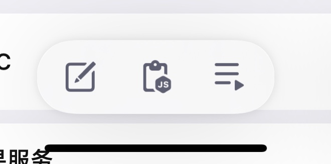
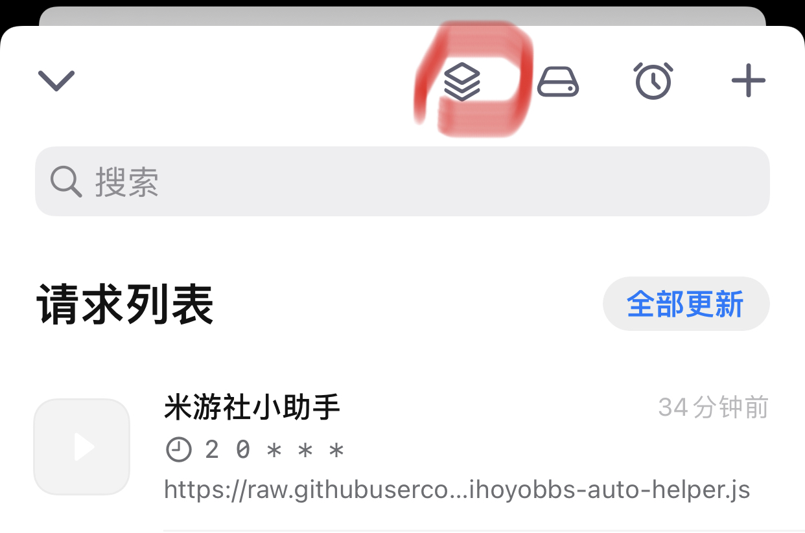
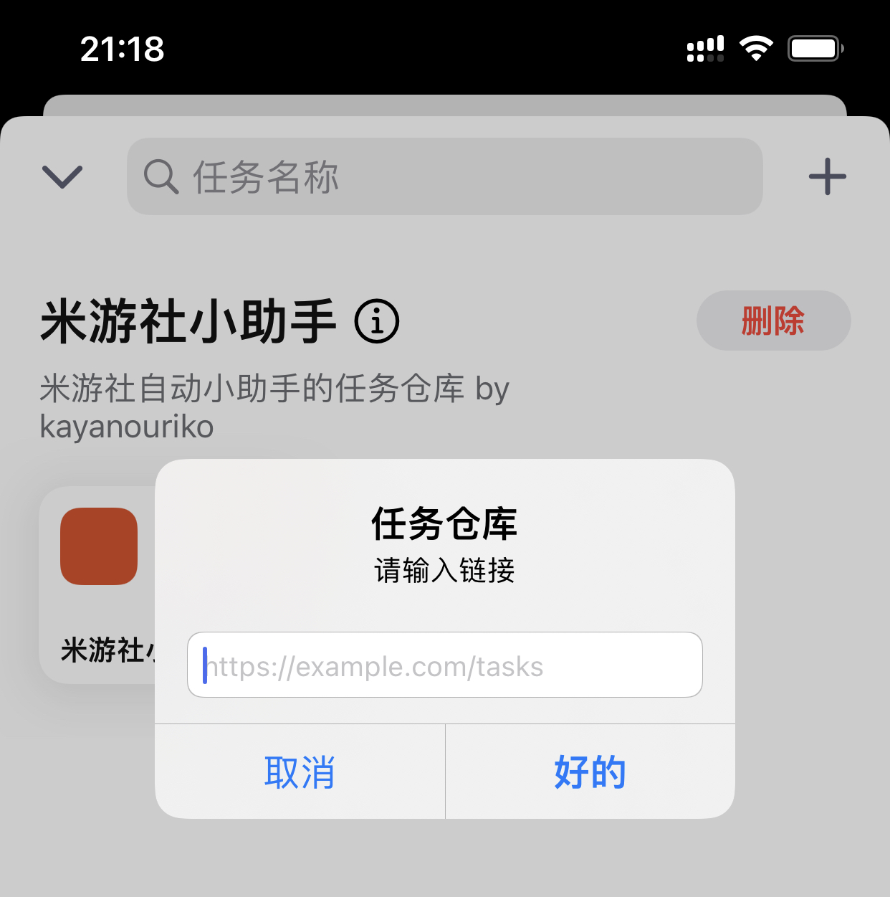
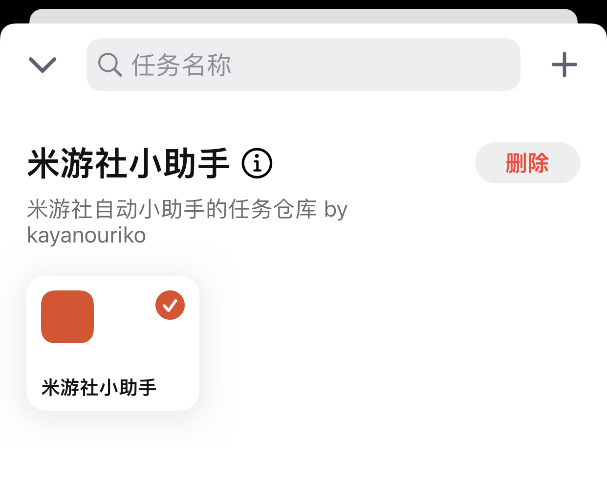
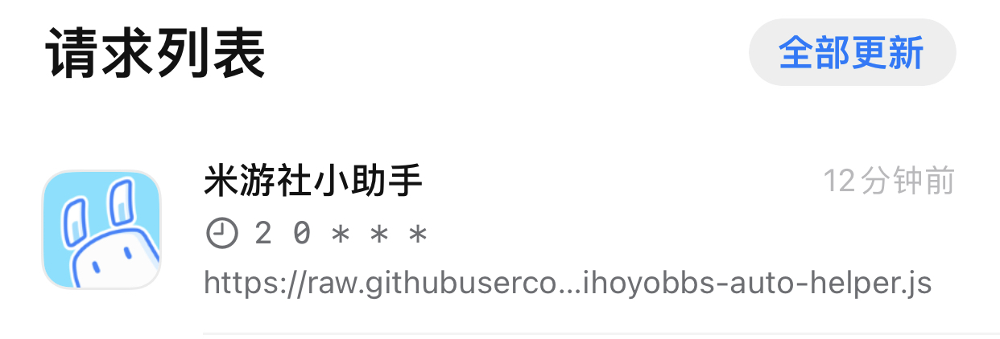
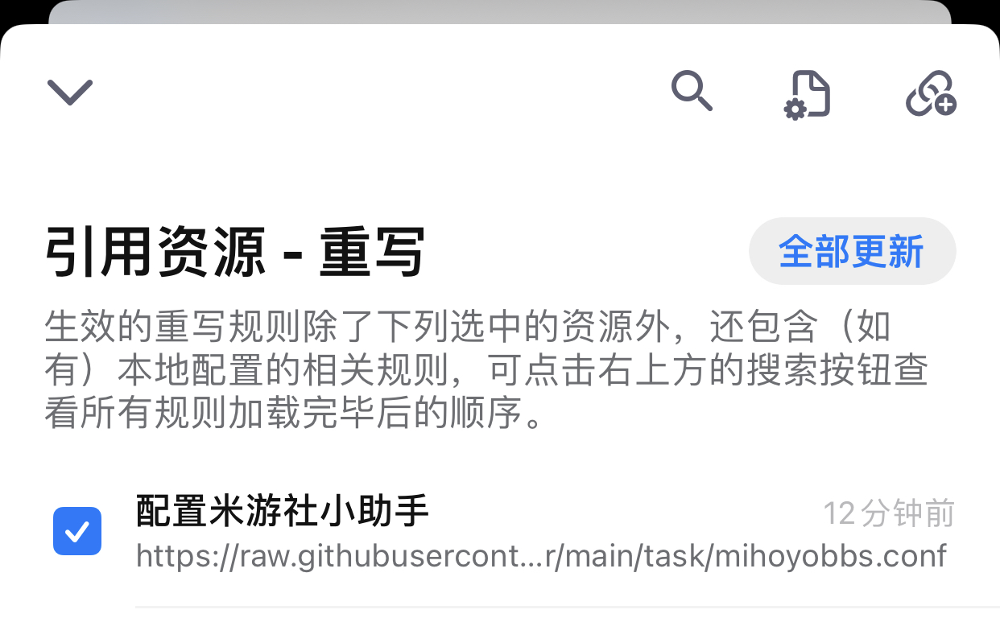
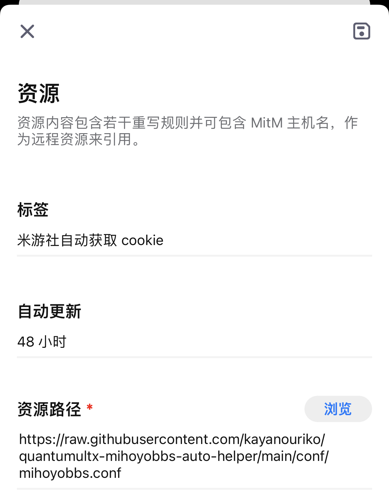
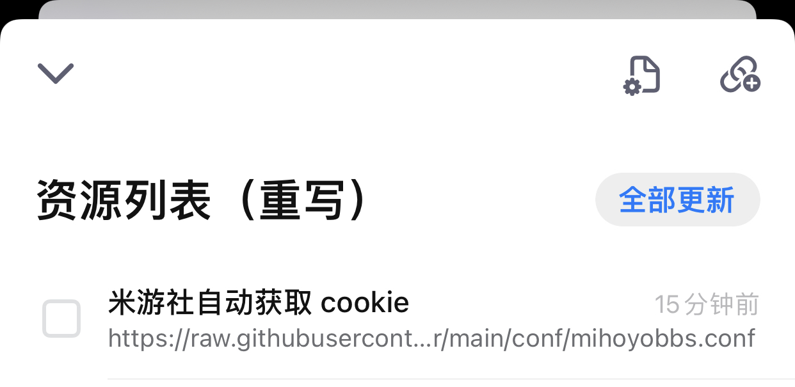

# 米游社小助手

 [](https://github.com/kayanouriko/quantumultx-genshin-autosign-helper/releases)

一个 quantumultx 脚本, 主要用于米游社米游币任务和游戏(原神和崩坏3rd)签到的自动运行.

## 前言

1. 该项目 v2 版本的关键业务参数均来源于: [@AutoMihoyoBBS](https://github.com/Womsxd/AutoMihoyoBBS), 感谢逆向接口参数可以直接抄作业.

2. 当使用该项目的前提下, 一个手机对应一个账号, 所以不支持多账号的功能是理所应当的. 当你有多账号需求时, 请使用上述等其他项目.

3. 该脚本只适配了国服账号.

4. 使用该项目之前, 你需要提前了解如何使用 quantumultx 拉取远程仓库和执行脚本.

    > 虽然是参照 quantumultx 编写, 但是使用的模块封装应该也适配 shadowrocket, loon, surge, stash. 

    > 别家应用的用户可以自行测试一下, 行就行, 不行也别找我了Orz

5. 目前 quantumultx 并不会自动升级远程配置的脚本, 当你发现脚本功能不可用时, 可先看该项目是否已经更新修复了, 再尝试在 quantumultx 内更新脚本以获取最新的修复.

    > 推荐点击项目右上角的 watch 按钮, 选择 custom 里面 Releases, 这样当脚本释出新版本时你能第一时间获取邮件通知以便在 quantumultx 内更新脚本.

## 更新日志

* v2.4.1
    1. 同步上游 salt 参数
    2. 去除调试打印


<details>
<summary>历史更新日志</summary>

* v2.4.0
    1. 修复原神签到风控问题
        > 注意需要同时更新配套的重写规则并重新获取 headers. 更加详细说明参照下文 *关于原神签到的说明* 部分
* v2.3.1
    1. 原神签到添加风控验证码的判断
    2. 优化 headers 代码逻辑
    3. 优化请求出错的报错提示
* v2.3.0
    1. 更新米游币任务相关接口相关参数
        > 推荐更新一下自己的 cookie 防止出现问题
* v2.2.0
    1. 更新 header 相关参数适配米游币新接口
    2. 更新图片资源
    3. 更新了仓库内容, 将重写规则也加入仓库, 现在无需另外手动添加重写链接了.(有需要的童鞋可以删除原来的仓库链接和重写链接, 添加并使用新的仓库来下载重写规则, 方便以后更新)
* v2.1.0
    1. 适配 崩坏3rd 签到新接口. [@接口改版抓包讨论](https://github.com/Womsxd/AutoMihoyoBBS/issues/151)
* v2.0.3
    1. 修复分享任务代码造成的米游币任务完成提示文本错误
* v2.0.2
    1. 修复分享任务成功判断问题
* v2.0.1
    1. 缩短米游币任务报告文本
    2. 修复分享任务报告文本无法显示的问题
* v2.0.0
    1. 支持米游币任务和崩坏3rd签到
    2. 自动获取 cookie
    3. 可自定义任务执行配置
* v1.1.1
    1. 优化代码逻辑
* v1.1.0 
    1. 新增签到奖励信息
    2. 优化代码逻辑
* v1.0.0 
    1. 初版

</details>

## 如何使用

v2.0.0开始, 在 quantumultx 中全面转为远程更新和执行, 配置一次, 自动更新, 永久运行.  

### 引入资源

|          |
| :------------------------------: |
| 打开应用底部最右侧图标<br>task-1 |

|  |
| :----------------------: |
|  点击红框图标<br>task-2  |

|                |
| :------------------------------------: |
| 点击右上角加号, 输入仓库地址<br>task-3 |

```
// 仓库地址连接
https://raw.githubusercontent.com/kayanouriko/quantumultx-mihoyobbs-auto-helper/main/task/gallery.json
```

|                                                 |
| :---------------------------------------------------------------------: |
| 点击米游社小助手, 在弹出的 sheet 中分别选择添加和添加附加组件<br>task-4 |

|  <br>   |
| :--------------------------------------------------------: |
| 请求列表和重写列表如图所示即为添加成功<br>task-5 rewrite-1 |

### 获取 cookie

|            |
| :-----------------------------------: |
| 保证重写列表的为打开状态<br>rewrite-1 |

> 重写需要配合 MitM 使用, 确保你的 MitM 也是开启状态

打开米游社 app, 此时会弹出第一条获取成功的通知, 再随便打开一个游戏的签到页面, 会收到第二条获取成功的通知. 如下所示

|              |
| :-------------------------------------: |
| 获取 cookie 成功的两条通知<br>rewrite-3 |

> 如果之前你的米游社 app 是处于后台开启状态, 可能需要清除后台, 重新打开米游社 app 才能收到米游币任务所需 cookie 获取成功的通知.

关闭重写列表, 以后 cookie 失效了再重新打开重复以上步骤重新获取 cookie 即可.

|  |
| :-------------------------: |
|  取消打勾操作<br>rewrite-2  |

### 至此, 脚本可以运行了.

### 进阶用法(自定义配置)

|  参数名  |            说明            |                                                              值                                                               |
| :------: | :------------------------: | :---------------------------------------------------------------------------------------------------------------------------: |
|  tasks   |     需要自动执行的任务     |                1. 米游币任务 2. 原神签到 3. 崩坏 3rd 签到. <br>默认为 1,2,3 执行米游币, 原神, 崩坏3rd 3个任务                 |
| scetions | 需要执行米游币任务的讨论区 | 1. 崩坏3, 26. 原神 30. 崩坏学园2 37. 未定事件簿 34. 大别野 52. 崩坏：星穹铁道 <br>默认为 34, 即在大别野帖子列表执行米游币任务 |
| actions  |    需要执行的米游币任务    |          58. 讨论区签到 59. 浏览 3 个帖子 60. 完成 5 次点赞 61. 分享帖子 <br>默认为 58,59,60,61 执行米游社的全部任务          |

#### 自定义配置使用方法

|            |
| :-----------------------------------: |
| 保证重写列表的为打开状态<br>rewrite-1 |

打开 safari 浏览器, 访问 `https://example.com/?参数名=值` 即可, 弹出设置成功的通知即为成功.

* 注1: 这里的 `https://example.com/?` 是固定的, 必须是这个网址才能设置成功.

* 注2: 关于链接 GET 请求传参的相关知识请参考: [Query String](https://en.wikipedia.org/wiki/Query_string)

例如: `https://example.com/?tasks=1,2&actions=58,59` 表示脚本执行 米游币任务 原神签到任务, 并且米游币任务中执行讨论区签到, 浏览 3 个帖子两个任务.

关闭重写列表, 以后想要重新自定义配置项重复上述步骤即可.

|  |
| :-------------------------: |
|  取消打勾操作<br>rewrite-2  |

## 关于原神签到的说明

米哈游在 2.33.1 版本左右单独为原神的签到加入了 CAPTCHA 测试.

在 [#179](https://github.com/Womsxd/AutoMihoyoBBS/issues/179) 的讨论中基本确定是针对 UserAgent 进行识别, 感谢大佬们的分析. 所以从 v2.4.0 版本起, 该脚本将获取用户整个请求的 headers 作为数据存储用以解决该问题.

而对于需要原神签到的用户, 之前出现过风控问题需要到 app 手动签到直至风控验证码消失, 再将本脚本更新到 v2.4.0 版本以及配套重写规则更新到 v1.1.0, 并打开重写规则重新获取 headers 数据, 即可解决风控问题. 

在以后手机系统和米游社 app 升级后, 都必须及时打开重写规则更新自己的 headers 防止风控问题.

## 感谢

* [@chavyleung/Env.js](https://github.com/chavyleung/scripts): 各家应用环境的统一封装
* [@NobyDa](https://github.com/NobyDa/Script): 一些原生算法解决方案参考
* [@AutoMihoyoBBS](https://github.com/Womsxd/AutoMihoyoBBS): v2版本业务逻辑部分基本来自该仓库
* [@genshin-sign-helper](https://github.com/daye99/genshin-sign-helper): v1版本业务逻辑部分基本来自该仓库
* [@GenshinPlayerQuery](https://github.com/Azure99/GenshinPlayerQuery/issues/20): 关键算法逻辑部分的来源
